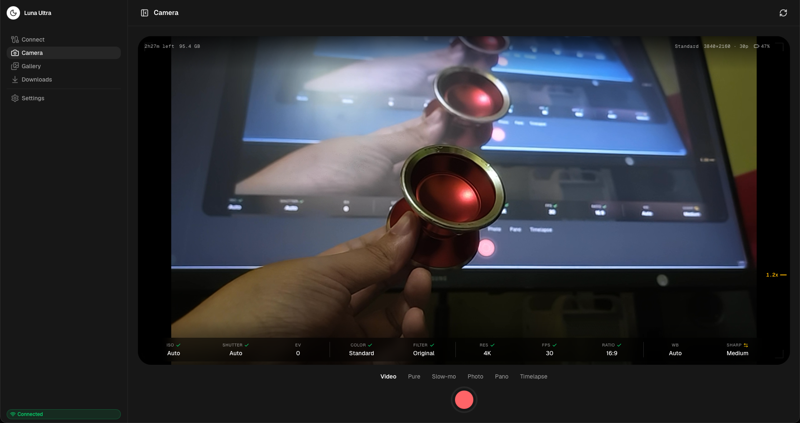

<p align="center">
  
</p>

<h1 align="center">Luna Ultra Desktop</h1>

<p align="center">
  A desktop companion for the <strong>Insta360 Luna Ultra</strong> camera.<br />
  <a href="https://v2.tauri.app/">Tauri 2</a> · <a href="https://nuxt.com/">Nuxt 4</a> · <a href="https://ui.nuxt.com/">Nuxt UI</a> · <a href="https://threejs.org/">Three.js</a>
</p>

<p align="center">
  <a href="https://github.com/Ripwords/insta360-luna-ultra-desktop/releases/latest/download/Luna-Ultra-Desktop-mac-apple-silicon.dmg"></a>
  <a href="https://github.com/Ripwords/insta360-luna-ultra-desktop/releases/latest/download/Luna-Ultra-Desktop-mac-intel.dmg"></a>
  <a href="https://github.com/Ripwords/insta360-luna-ultra-desktop/releases/latest/download/Luna-Ultra-Desktop-windows-x64.exe"></a>
  <a href="https://github.com/Ripwords/insta360-luna-ultra-desktop/releases/latest/download/Luna-Ultra-Desktop-linux-x86_64.AppImage"></a>
  <br /><br />
  <a href="https://github.com/Ripwords/insta360-luna-ultra-desktop/releases/latest"></a>
</p>

Connect over Wi-Fi to drive the camera from a live viewfinder, browse its media library, batch-download photos and videos with the official Luna Ultra watermark, delete files, and explore the camera as an interactive 3D model. Native desktop app for macOS, Windows, and Linux, with signed auto-updates.

<p align="center">
  
  
</p>

## Features

- **Real camera connection** — pairs with the Luna Ultra over its own Wi-Fi network using the camera's TCP control protocol and HTTP media index. No mock data.
- **Camera control** — live viewfinder with a HUD (recording time, storage, resolution, battery), 1×–12× zoom, six capture modes, and one-tap photo/video capture.
- **Pro bar** — exposure (ISO, shutter, EV, WB), look (colour mode, Leica and cinematic filters, strength), and format (resolution, framerate, aspect).
- **Gallery** — date-grouped grid with photo/video filtering, three thumbnail sizes, and a full-screen preview with metadata and keyboard navigation.
- **Multi-select** — click to toggle, shift-click for ranges, per-day select, select-all, with a floating action bar for downloads and deletes.
- **Downloads** — background queue with per-file progress, streamed straight from the camera to your Downloads folder.
- **Official watermark** — the genuine Insta360 Luna Ultra asset applied to photos on download, placed per the camera's real aspect-ratio layout table.
- **Delete** — removes files from camera storage over the control channel (permanent, with confirmation).
- **3D showpiece** — the camera rendered from its hi-fi 3D scan with orbit controls, in black or white to match the theme.
- **Two colorways** — Arctic (light) and Midnight (dark), matching the camera's finishes.
- **Auto-updates** — signed delta updates from GitHub Releases.

## Status

Everything above is verified against the camera itself. The camera has no
published API, and its failure mode is silent: it **accepts** a write,
**echoes** it as successful, and **reads back** a value a stale enum renders
under the wrong name. Nothing errors. So a feature only ships here once it has
been set from the app and confirmed on the camera's own screen.

|                         |                                                                                                                                                                                                                          |
| ----------------------- | ------------------------------------------------------------------------------------------------------------------------------------------------------------------------------------------------------------------------ |
| 🧪 **Built, gated off** | The full settings panel — stabilisation, format, capture timers, metering, bitrate, RAW (~30 controls), plus live-view diagnostics. Written and rendering, waiting on on-device verification.                            |
| ○ **Known gaps**        | UltraPhoto capture mode, video watermarking, white-balance read-back, macOS notarization / Windows signing.                                                                                                              |
| ⏸ **On hold**           | Gimbal pan/tilt, gimbal attitude/gyro, Colour Recovery, Deep Track, tap to focus. Heavily probed, nothing readable found yet — parked pending further experimentation, most likely by capturing the phone app's traffic. |

**[→ Full feature map](docs/FEATURES.md)** — the same picture area by area, with
the measured field numbers, the per-mode availability rules, what was already
tried on the parked features, and the six-step bar a feature has to clear to
ship.

<details>
<summary><strong>More screenshots</strong></summary>

| Connect & 3D showpiece                              | Multi-select                               |
| --------------------------------------------------- | ------------------------------------------ |
|  |  |

| Download + watermark                               | Full-screen preview                    |
| -------------------------------------------------- | -------------------------------------- |
|  |  |

| Downloads queue                            | Light theme (Arctic)                             |
| ------------------------------------------ | ------------------------------------------------ |
|  |  |

</details>

## Installing

Download the installer for your platform from the [latest release](https://github.com/Ripwords/luna-ultra-desktop/releases/latest).

The app is not yet code-signed with a paid developer identity, so each OS shows
a first-launch warning:

<details>
<summary><strong>macOS</strong> — "'Luna Ultra Desktop' is damaged and can't be opened"</summary>

Signed ad-hoc but not notarized, so Gatekeeper quarantines it on download. The
app isn't actually damaged. Drag it to **Applications**, then clear the
quarantine attribute:

```bash
xattr -cr "/Applications/Luna Ultra Desktop.app"
```

Then open it normally (or right-click → Open the first time). If the app lives
elsewhere, point the command at that path instead. `xattr -cr` clears all
extended attributes recursively; to remove only the quarantine flag, use
`xattr -dr com.apple.quarantine "/Applications/Luna Ultra Desktop.app"`.

**Local-network permission.** Reaching the camera at `192.168.42.1` requires
macOS's Local Network permission — allow it when prompted, or enable it under
**System Settings › Privacy & Security › Local Network**.

The permanent fix is Apple Developer ID signing + notarization (paid account
required); once set up this step goes away.

</details>

<details>
<summary><strong>Windows</strong> — "Windows protected your PC" (SmartScreen)</summary>

Unsigned, so SmartScreen warns on first launch: click **More info → Run
anyway**. The MSI installer also shows a standard UAC prompt. No firewall
permission is needed — Windows allows the outbound connection to the camera
automatically.

</details>

<details>
<summary><strong>Linux</strong> — AppImage, .deb, .rpm</summary>

AppImage: make it executable and run it. Some distributions need FUSE — on
Ubuntu 22.04+ install it with `sudo apt install libfuse2`.

```bash
chmod +x "Luna Ultra Desktop_0.1.0_amd64.AppImage"
./"Luna Ultra Desktop_0.1.0_amd64.AppImage"
```

`.deb` / `.rpm`: install with your package manager (`sudo apt install ./*.deb`
or `sudo dnf install ./*.rpm`). No local-network permission is required.

Auto-updates apply to the **AppImage** build only — `.deb` and `.rpm` installs
must be updated manually.

</details>

## How it connects

The Luna Ultra exposes two services on its Wi-Fi network (default gateway `192.168.42.1`):

- **TCP control (port 6666)** — a UCD2-framed binary protocol used for the auth handshake, device info, and delete commands. A live control session also unlocks the HTTP media index.
- **HTTP (port 80)** — an autoindex-style listing of the camera's storage, plus `Range`-capable file downloads.

The control protocol is implemented in Rust (`src-tauri/src/luna.rs`) and exposed to the frontend as Tauri commands; the HTTP index is parsed on the frontend (`app/utils/lunaIndex.ts`). The protocol was reconstructed from the open-source [`diamondfsd/luna-ai-cut`](https://github.com/diamondfsd/luna-ai-cut) project, which also ships the mock camera server vendored here under `luna_mock_server/`.

## Development

Requires [Bun](https://bun.sh/), [Rust](https://rustup.rs/), and the [Tauri prerequisites](https://v2.tauri.app/start/prerequisites/) for your OS.

```bash
bun install
bun run dev      # full desktop app (Tauri + Nuxt)
bun run ui:dev   # web frontend only — camera control unavailable
```

Camera control requires the desktop app; a browser cannot open the raw TCP
socket. In `ui:dev` the Connect screen says so.

```bash
bun x vitest run                                   # frontend unit tests
bun run typecheck                                  # Nuxt/vue-tsc
bun run lint                                       # oxlint
cargo test --manifest-path src-tauri/Cargo.toml    # Rust protocol + integration tests
bun run build                                      # bundles → src-tauri/target/release/bundle/
```

<details>
<summary><strong>Testing against the mock camera</strong></summary>

The vendored `luna_mock_server/` emulates the real Luna Ultra protocol. Point it
at a folder of media, then connect the app to it:

```bash
node luna_mock_server/server.mjs \
  --root /path/to/media --host 127.0.0.1 --http-port 18080 --tcp-port 6666
```

Launch `bun run dev` and connect to `127.0.0.1:18080` from the Connect screen.

</details>

<details>
<summary><strong>Project layout</strong></summary>

```
app/                     Nuxt frontend (pages, components, composables, utils)
  composables/useCamera     Connection lifecycle, auto-reconnect
  composables/useGallery    Selection, filtering, delete
  composables/useDownloads  Download queue + watermark compositing
  composables/useUpdater    Auto-update checker
  utils/lunaClient.ts       Bridge to the Rust commands + HTTP listing
  utils/lunaIndex.ts        Camera HTTP index parser
  utils/watermark*.ts       Official watermark placement engine
src-tauri/src/luna.rs    Luna Ultra TCP control protocol (Rust)
luna_mock_server/        Camera emulator for development and tests
scripts/probe-*.mjs      On-device protocol probes (calibration, live view, file list)
tests/                   Vitest unit tests
docs/FEATURES.md         Feature map: shipped, gated, and on hold
docs/superpowers/specs/  Protocol findings of record
screenshots/             Product screenshots
```

</details>

## Releases & auto-updates

Cutting a release is one command:

```bash
bun run release
```

[`changelogen`](https://github.com/unjs/changelogen) derives the next version
from your [Conventional Commits](https://www.conventionalcommits.org/), updates
`CHANGELOG.md`, syncs the version into `package.json`, `src-tauri/tauri.conf.json`
and `Cargo.toml`, then commits, tags, and pushes. Force a bump with
`bun run release -- --patch` / `--minor` / `--major`; preview notes without
cutting via `bun run changelog`.

Pushing the tag triggers `.github/workflows/release.yml`: it opens a single
GitHub Release, builds and signs bundles for macOS (Apple Silicon + Intel),
Windows, and Linux with [`tauri-action`](https://github.com/tauri-apps/tauri-action),
uploads them plus the `latest.json` manifest, and publishes once every platform
succeeds (a failed platform leaves it a draft). The app checks for updates on
launch and hourly, prompting in the sidebar (`app/composables/useUpdater.ts`).

<details>
<summary><strong>One-time setup</strong></summary>

1. **Updater endpoint** — in `src-tauri/tauri.conf.json`, already set to this repo:

   ```json
   "endpoints": ["https://github.com/<owner>/luna-ultra-desktop/releases/latest/download/latest.json"]
   ```

2. **Signing keys** — a keypair already exists. The public key is committed in
   `tauri.conf.json`; the private key is `src-tauri/luna-ultra-updater.key` and is
   git-ignored. Add it as a repository secret (`TAURI_SIGNING_PRIVATE_KEY`;
   `TAURI_SIGNING_PRIVATE_KEY_PASSWORD` is unneeded for this passwordless key):

   ```bash
   gh secret set TAURI_SIGNING_PRIVATE_KEY < src-tauri/luna-ultra-updater.key
   ```

   Rotate with `bun x tauri signer generate -w src-tauri/luna-ultra-updater.key`,
   then paste the new public key into `tauri.conf.json`.

   > **Keep the private key safe.** If it is lost, existing installs can no longer verify updates.

</details>

## Credits

Camera protocol and the official watermark assets are derived from [`diamondfsd/luna-ai-cut`](https://github.com/diamondfsd/luna-ai-cut). Insta360 and Luna Ultra are trademarks of their respective owners; this is an unofficial companion app.
